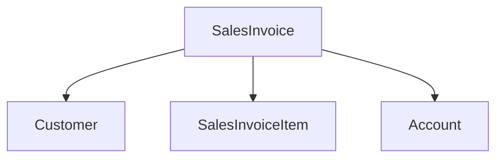

# AI Modernization Internship – Code Analyzer

## Overview
This project is a lightweight code intelligence tool designed to analyze
legacy ERP code and extract meaningful structure from it.

The tool focuses on the **Sales Invoice module of ERPNext**, a real-world
business domain containing critical accounting and validation logic.

## Target System
ERPNext (Python, Frappe Framework)

**Analyzed path:**
erpnext/accounts/doctype/sales_invoice/

## Problem Statement
Large ERP systems contain deeply interconnected business logic that is
difficult to understand by manually reading code. Before applying AI or
modernization techniques, it is essential to extract entities,
relationships, and domain structure from the existing system.

## What This Tool Does
- Reads ERPNext Sales Invoice source files
- Extracts entity schema from JSON definitions
- Extracts classes and functions from Python business logic
- Identifies relationships between core business entities
- Generates structured outputs and visual diagrams

## How to Run
```bash
git clone https://github.com/frappe/erpnext.git
python src/analyze.py
```

## Generated Outputs
- entities.json – Fields, classes, and functions extracted
- relationships.mermaid – Entity relationship diagram
- summary.md – Human-readable explanation of findings

## Example Output
Entity Extraction (entities.json)
```json
{
  "entity": "Sales Invoice",
  "classes": ["SalesInvoice"],
  "functions": ["validate", "on_submit"],
  "relationships": ["Customer", "Item", "Account"]
}
```

## Relationship Diagram


## Key Learnings
- ERPNext separates schema and business logic clearly
- Core business rules are implemented through lifecycle hooks
- Lightweight static analysis can reveal valuable system insights

## Limitations
- No deep call-graph analysis
- Focused on a single ERP module
- Python-only analysis

## Future Improvements
- Cross-module dependency extraction
- Automated business rule detection
- Expanded diagram generation